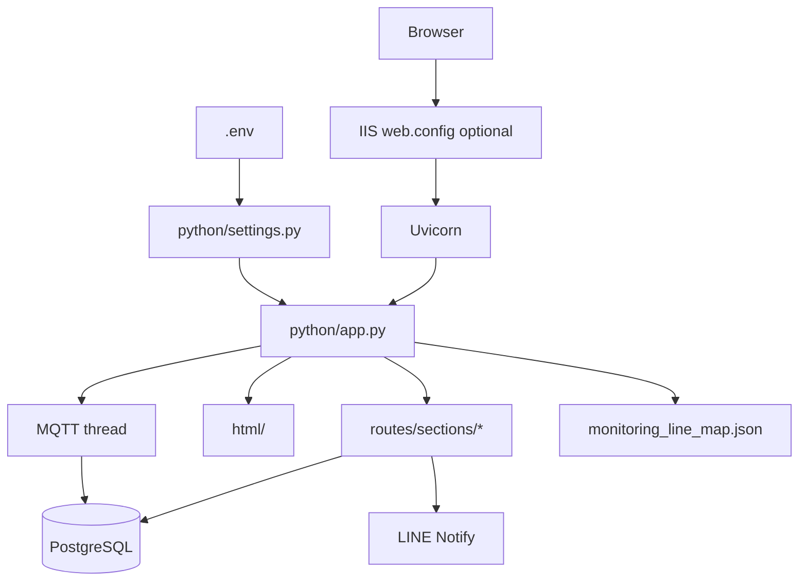

# SupportHub — Codebase Summary

**SupportHub** (UI brand: "ME SupportHub") is a manufacturing-engineering support
ticket system for production lines. Technicians create and manage equipment problem
tickets, admins maintain master data (lines, machines, problems), and the app provides
history export, OEE monitoring metrics, and live MQTT power telemetry.

---

## Tech Stack

- **Backend:** Python 3, FastAPI, Uvicorn (ASGI)
- **Templating:** Jinja2 (server-rendered HTML)
- **Database:** PostgreSQL via SQLAlchemy 2 + psycopg 3
- **Config:** python-dotenv (`.env` → `python/settings.py`)
- **IoT:** paho-mqtt (background telemetry subscriber)
- **Export:** xlsxwriter (Excel)
- **Auth:** itsdangerous signed session cookies, SHA-256 passwords
- **Notifications:** LINE Notify (optional)
- **Deployment:** Windows + IIS reverse proxy (optional)

No frontend build step or JS framework — plain HTML/CSS/JS in templates.

---

## Project Structure

| Path | Purpose |
|------|---------|
| `python/` | FastAPI app, routes, auth, database, IoT, OEE |
| `python/settings.py` | All config read from `.env` |
| `python/load_env.py` | Loads `.env` on import |
| `html/` | Jinja2 HTML templates |
| `db/` | PostgreSQL DDL (`01_*.sql`) + `apply.bat` |
| `python/master_data.py` | Default master data + manual seed CLI |
| `.env` | Local config (not in git) — copy from `.env.example` |
| `web.config` | IIS reverse proxy only (no secrets) |
| `requirements.txt` | Python dependencies |

---

## Entry Points

| File | Role |
|------|------|
| `python/server_app.py` | Uvicorn entry — loads `.env`, imports `app` |
| `python/app.py` | FastAPI app, routes, IoT lifecycle, master-data helpers |
| `python/master_data.py` | Default master data constants + **manual** DB seed CLI |

**App startup (`python/app.py`):**

1. `init_db()` — tables, PostgreSQL views/triggers, optional ADMIN bootstrap
2. `register_web_routes(...)` — HTTP routes
3. `startup` / `shutdown` — MQTT IoT background thread

Master data is **not** seeded on app startup. Run once manually (see below).

---

## Configuration

All app settings are in **`.env`**. See `.env.example` for the full list.

| Variable | Purpose |
|----------|---------|
| `SUPPORTHUB_DATABASE_URL` | PostgreSQL URL (required) |
| `SUPPORTHUB_BOOTSTRAP_ADMIN_PASSWORD` | Create `ADMIN` user on first `init_db()` |
| `SUPPORTHUB_ENV` | `local` / `dev` / production |
| `SUPPORTHUB_SECRET` | Session signing (auto-generated if empty) |
| `SUPPORTHUB_SESSION_AGE` | Cookie lifetime in seconds (default 604800 = 7 days) |
| `SUPPORTHUB_SECURE_COOKIES` | `true` / `false` |
| `SUPPORTHUB_HOST` | Uvicorn bind host (default `127.0.0.1`) |
| `SUPPORTHUB_PORT` | Uvicorn bind port (default `8888`) |
| `SUPPORTHUB_LINE_MACHINE_MAP_FILE` | Path to line→monitoring JSON (empty = default under `database/`) |
| `LINE_NOTIFY_TOKEN` | LINE Notify bearer token (optional) |
| `SUPPORTHUB_MQTT_HOST` | MQTT broker host |
| `SUPPORTHUB_MQTT_PORT` | MQTT broker port |
| `SUPPORTHUB_MQTT_TOPIC` | MQTT subscribe topic |
| `SUPPORTHUB_MQTT_CLIENT_ID` | MQTT client id |
| `SUPPORTHUB_IOT_SAMPLE_LIMIT` | In-memory trend samples per metric |

**Load order:** `import python.load_env` → reads `.env` → `python/settings.py` exposes values.

`web.config` is for IIS proxy to Uvicorn only.

---

## Database

### Schema (manual / optional)

```bat
cd db
apply.bat
```

SQL files: `01_core_tables.sql`, `02_iot_tables.sql`, `03_history_view.sql`.  
Details: `db/README.md`.

### App layer

```
python/load_env.py      → loads .env
python/settings.py      → DATABASE_URL, MQTT, auth, etc.
python/db.py            → re-exports database.core
python/database/
  core.py               → SQLAlchemy models, init_db(), triggers/views
  __init__.py
```

- **Connection:** `SUPPORTHUB_DATABASE_URL` in `.env` (PostgreSQL only).
- **Session:** `get_db()` per request.

### Core tables

| Model | Table | Purpose |
|-------|-------|---------|
| `User` | `users` | Auth |
| `Ticket` | `tickets` | Support tickets + workflow |
| `TicketTakeoverLog` | `ticket_takeover_logs` | Handoff audit |
| `MasterLine` | `master_lines` | Line numbers |
| `MasterMachine` | `master_machines` | Machine categories |
| `MasterMachineType` | `master_machine_types` | Machine types |
| `MasterMachineId` | `master_machine_ids` | Machine IDs |
| `MasterProblem` | `master_problems` | Problems |
| `MasterSupportArea` | `master_support_areas` | Support areas |
| `MasterSupportAreaMap` | `master_support_area_maps` | Area ↔ machine |
| `AppSetting` | `app_settings` | Key-value (e.g. seed flag) |
| `MasterAuditLog` | `master_audit_logs` | Admin audit |

**Ticket workflow:** `PENDING → DOING → HOLD → DONE / CANCELLED`

**PostgreSQL extras (from `init_db()`):** `v_history_log`, reporting tables + triggers, IoT tables.

**File-based:** `database/monitoring_line_map.json` (gitignored) for line→monitoring mapping.

---

## Master data (manual seed)

Defaults live in `python/master_data.py` (lines, machines, types, problems, support areas).

**First-time seed** (after DB schema exists):

```powershell
cd d:\project\supporthub
.\venv\Scripts\Activate.ps1
python -m python.master_data
```

- Runs once; sets `app_settings.master_seed_v1 = 1`.
- To seed again: `DELETE FROM app_settings WHERE key = 'master_seed_v1';` then re-run.

Edit defaults in `python/master_data.py` before seeding.

---

## How to Run

### 1. Setup

```powershell
cd d:\project\supporthub
copy .env.example .env
# edit .env — especially SUPPORTHUB_DATABASE_URL

python -m venv venv
.\venv\Scripts\Activate.ps1
pip install -r requirements.txt
```

### 2. Database

```bat
cd db
apply.bat
```

Or let `init_db()` create tables on first app start.

### 3. Master data + ADMIN

```bat
python -m python.master_data
```

Set `SUPPORTHUB_BOOTSTRAP_ADMIN_PASSWORD` in `.env` before first app start for `ADMIN` user.

### 4. Start app

```powershell
python -m uvicorn python.server_app:app --host 127.0.0.1 --port 8888
```

Host/port can match `.env` (`SUPPORTHUB_HOST`, `SUPPORTHUB_PORT`).

Open http://127.0.0.1:8888/

---

## Major Modules

| Module | Path | Responsibility |
|--------|------|----------------|
| Settings | `python/settings.py` | Config from `.env` |
| App | `python/app.py` | FastAPI, line-machine map, route deps |
| Routes | `python/routes/web_routes.py` + `sections/*` | HTTP handlers |
| Auth | `python/auth.py` | Sessions, passwords |
| DB | `python/database/core.py` | ORM, `init_db()` |
| Master seed | `python/master_data.py` | Default master data + CLI |
| OEE | `python/OEE/oee_metrics.py` | Downtime, MTTR, MTBF, OEE % |
| IoT | `python/IoT/iot_monitor_service.py` | MQTT → PostgreSQL + live API |
| Notify | `python/notify.py` | LINE Notify |

### UI templates (`html/`)

| Template | Page |
|----------|------|
| `index.html` | Active tickets + create request |
| `login.html`, `add_user.html` | Login / signup |
| `history.html` | Ticket history |
| `OEE/monitoring.html` | OEE dashboard |
| `IoT/iot_monitor.html` | Live MQTT telemetry |
| `add_machine.html` | Admin master data |
| `manage_users.html` | Admin users |

---

## Routes (summary)

| Area | Examples |
|------|----------|
| Auth | `GET/POST /login`, `/logout`, `/signup` |
| Tickets | `GET /`, `POST /request/create`, `POST /tickets/{id}/action` |
| History / OEE / IoT | `/history`, `/export/excel`, `/monitoring`, `/iot-monitor`, `/api/iot-monitor/status` |
| Polling | `GET /api/active/version` |
| Admin | `/admin/users`, `/admin/machines` (+ CRUD POST routes) |

---

## Architecture



---

## Design notes

1. Monolithic FastAPI; routes registered via a shared `deps` dict.
2. PostgreSQL only — invalid/missing `SUPPORTHUB_DATABASE_URL` fails at import.
3. Config centralized in `.env` + `settings.py` (not `web.config`).
4. Master data seed is manual (`python -m python.master_data`), not on every app start.
5. Line monitoring map stored in JSON file, synced to a PG table for reporting.
6. Real-time ticket list: `ACTIVE_VERSION` + poll `/api/active/version`.
7. Display times use Thailand UTC+7 (`python/time_utils.py`).
8. Roles: Operator, Engineer, Technician, Admin. Public signup allows non-admin roles only; non-admin usernames must be exactly 6 digits.

---

## Tests

No automated test suite in the repo.
